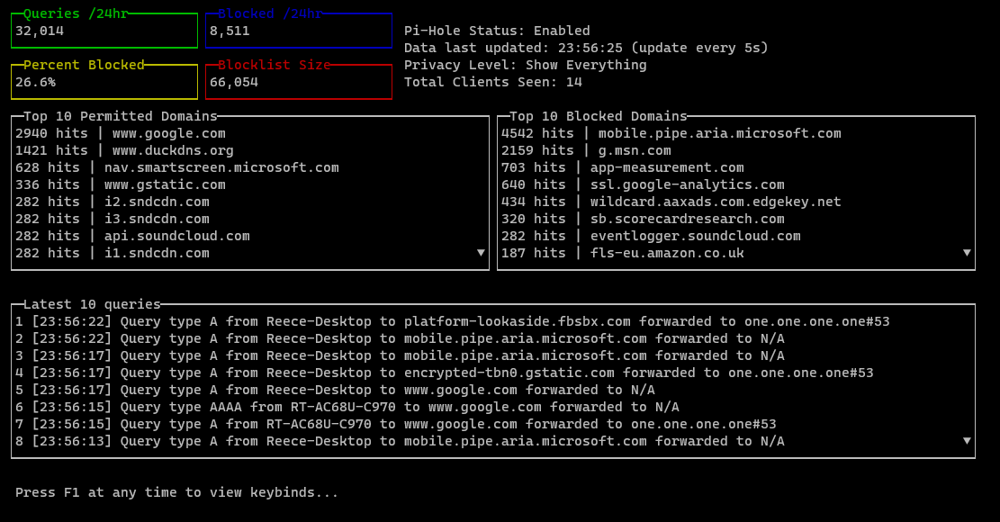

<h1 align="center">Pi-CLI</h1>

<p align="center">
    <a href="https://github.com/Reeceeboii/Pi-CLI/actions/workflows/codeql-analysis.yml">
        
    </a>
        <a href="https://goreportcard.com/report/github.com/Reeceeboii/Pi-CLI">
        
    </a>
</p>

<h2 align="center">Pi-CLI is a command line program used to view data from a Pi-Hole instance directly in your terminal.</h2>

<br/>



# Features

- Live view
  - As shown above, Pi-CLI can generate a live updating view of your Pi-Hole data
  - Updates down to a minimum of 1s, providing essentially live query data. Support for smaller intervals may come in the future.
  - Update parameters including the number of logged queries in the 'latest queries' table and watch the UI automatically update and pull in the correct data for you. Use your arrow keys to scroll and navigate the table.
- One off commands
  - Don't want a live view? Use one of the subcommands of Pi-CLI to tell it exactly what data you want, and it will give it to you. No fancy UI needed.
- Database analysis
  - Pi-CLI has the newly added ability to be able to analyse the `pihole-FTL.db` database used a long term data store
    for a Pi-Hole. It can extract and analyse all time data, including client, query and ad domain data.
- Quickly configure and forget
  - Run one setup command, and Pi-CLI will store and remember all of your details for next time.
- Lightweight
  - In its default configuration, the live view of Pi-CLI only uses ~10 MB memory, usually less.
- Secure
  - Pi-CLI uses cross-platform OS keyring libraries to make sure your Pi-Hole API key is both securely stored and easy to retrieve in the future. Your API key is never stored in plaintext unless you explicitly tell Pi-CLI to not use your keyring.

# Usage

### `~$ picli [global options] command [command options] [arguments...]`

<br>

For help, run `~$ picli h`

For command help, run `~$ picli <command> h`

For subcommand help, run `~$ picli <command> -h`


<br>

# Commands

```
   setup, s     Configure Pi-CLI
   config, c    Interact with stored configuration settings
   run, r       Run a one off command without booting the live view
   database, d  Analytics options to run on a Pi-Hole's FTL database
   help, h      Shows a list of commands or help for one command
```

### The `config` command

_Manage stored config data_

```
   delete, d  Delete stored config data (config file and API key)
   view, v    View config stored config data (config file and API key)
   help, h    Shows a list of commands or help for one command
```

### The `run` command

_Run a single command without the live view_

```
   summary, s          Extract a basic summary of data from the Pi-Hole
   top-forwarded, tf   Extract the current top 10 forwarded DNS queries
   top-blocked, tb     Extract the current top 10 blocked DNS queries
   latest-queries, lq  Extract the latest queries
   enable, e           Enable the Pi-Hole
   disable, d          Disable the Pi-Hole
   help, h             Shows a list of commands or help for one command
```

### The `database` command

_These commands are ran against a Pi-Hole's FTL database file and provide **all time** data metrics_

```
   client-summary, cs  Summary of all Pi-Hole clients
   top-queries, tq     Returns the top (all time) queries
   help, h             Shows a list of commands or help for one command
```

#### Global options
```
   --environment, --env  Load .env file (default: false)
   --log, -l             Enable debug logging. Saves to user's home directory (default: false)
   --help, -h            show help (default: false)
```

# FAQ

- Where do I get my API key?
  - Navigate to your Pi-Hole's web interface, then settings. Click on the API/Web interface tab and press
    'Show API token'.
- Pre-Compiled binaries?
  - See [releases](https://github.com/Reeceeboii/Pi-CLI/releases)
- How do I compile myself?

  - With [make](https://www.gnu.org/software/make/)! There is a `Makefile` in the
    [cmd/main](https://github.com/Reeceeboii/Pi-CLI/tree/master/cmd/main) directory that can be used for compilation
    on Windows, Mac and Linux.

  Compilation targets are: `win`, `mac` and `linux`
---

If you find Pi-CLI useful, please consider [donating to the Pi-Hole project](https://pi-hole.net/donate/)

Or, feel free to submit code to make Pi-CLI even more useful!
