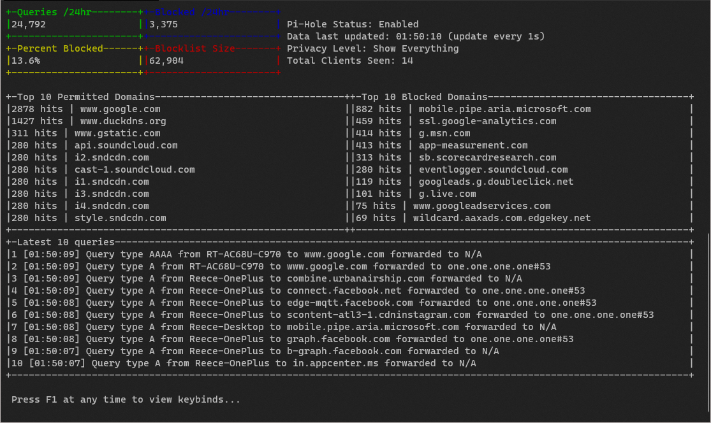

# Pi-CLI
### Pi-CLI is a command line program used to view data from a Pi-Hole instance directly in your terminal.



## Features

- Live view 
    - As shown above, Pi-CLI can generate a live updating view of your Pi-Hole data
    - Updates down to a minimum of 1s, providing essentially live query data. Support for smaller intervals may come in the future.
    - Update parameters including the number of queries being logged in the 'latest queries' table and watch the UI automatically update and pull in the correct data for you. Use your arrow keys to scroll and navigate the table.
- One off commands
    - Don't want a live view? No worries! Use one of the subcommands of Pi-CLI to tell it exactly what data you want, and it will give it to you. No fancy UI needed.
- Quickly configure and forget
    - Run one setup command, and Pi-CLI will store and remember all of your details for next time.
- Lightweight
    - In its default configuration, the live view of Pi-CLI only uses ~10MB memory, usually less.
- Secure
    - Your API key is never stored in plaintext. Pi-CLI uses cross-platform OS keyring libraries to make sure your Pi-Hole API key is both securely stored and easy to retrieve in the future.
    
## Usage
### `   picli.exe [global options] command [command options] [arguments...]                                                  `
For help, run `~$ ./picli -h`

### Commands
```
   setup, s   Configure Pi-CLI
   config, c  Interact with stored configuration settings
   run, r     Run a one off command without booting the live view
   help, h    Shows a list of commands or help for one command
```

### One off use of the `run` command
```
   summary, s          Extract a basic summary of data from the Pi-Hole
   top-queries, tq     Extract the current top 10 permitted DNS queries
   top-ads, ta         Extract the current top 10 blocked domains
   latest-queries, lq  Extract the latest x queries. Takes a flag for -q, the number of queries to extract
```

### FAQ
- Where do I get my API key?
    - Navigate to your Pi-Hole's web interface, then settings. Click on the API/Web interface tab press 'Show API token'
- Pre-Compiled binaries?
    - See [releases](https://github.com/Reeceeboii/Pi-CLI/releases)
- How do I compile myself?
    - `cd ./src && go build -o picli`

--- 
If you find Pi-CLI useful, please consider [donating to the Pi-Hole project](https://pi-hole.net/donate/)

Or, feel free to submit code to make Pi-CLI even more useful!